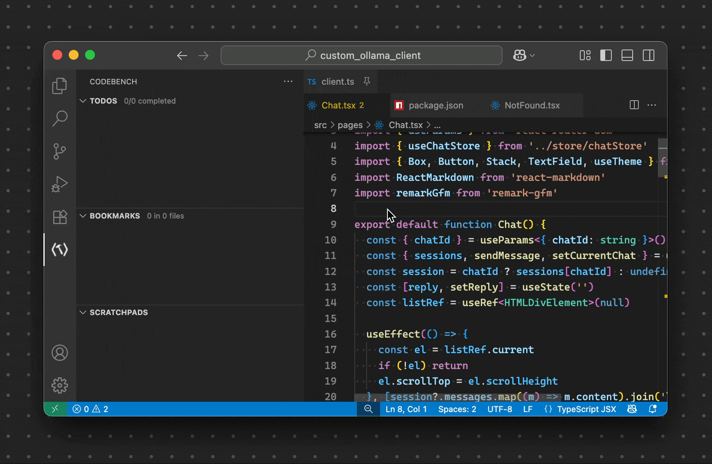
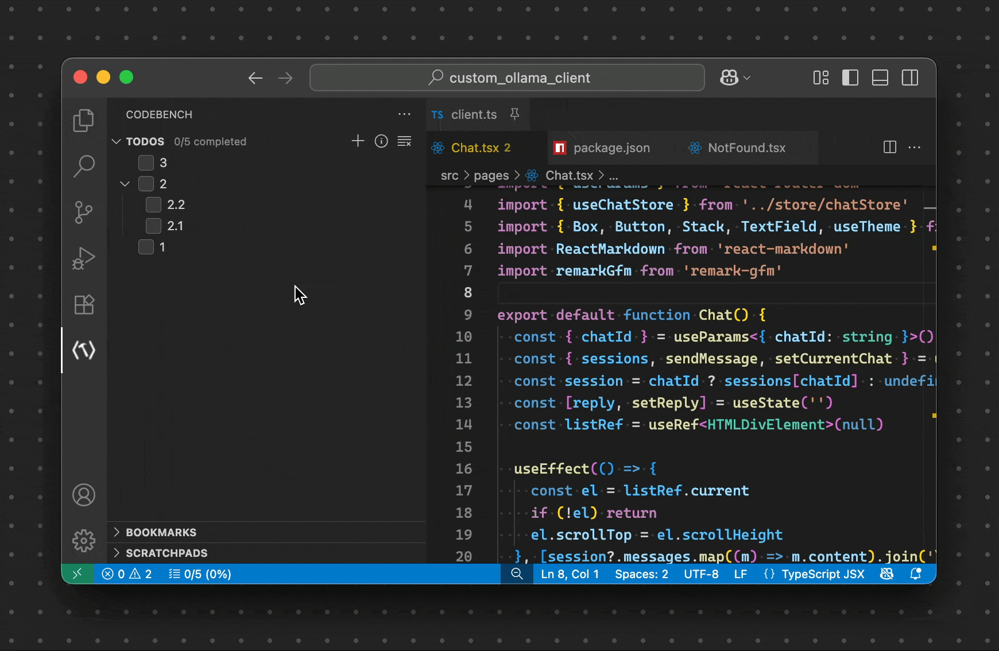
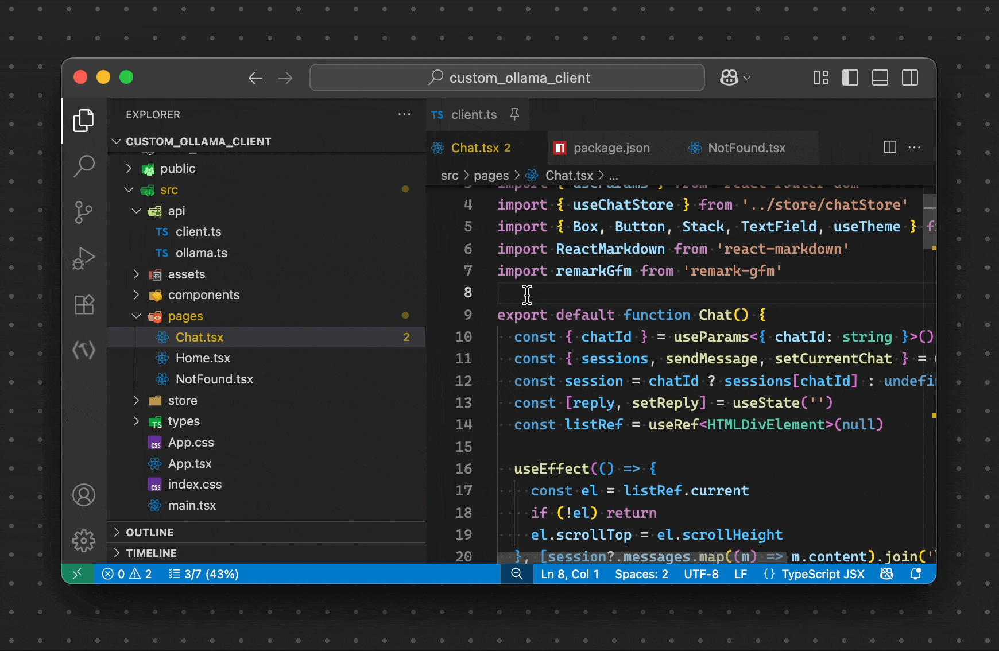
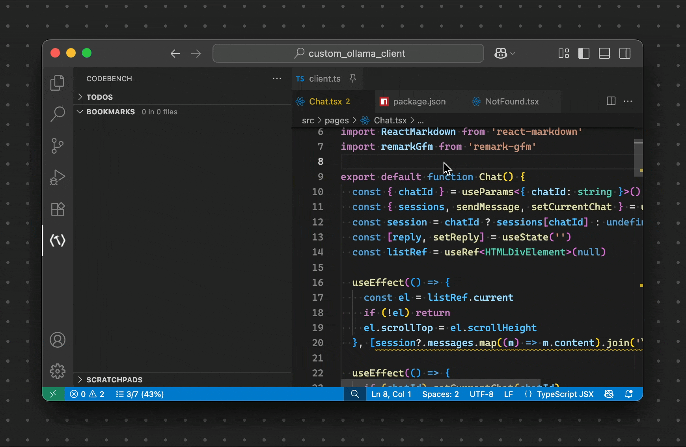
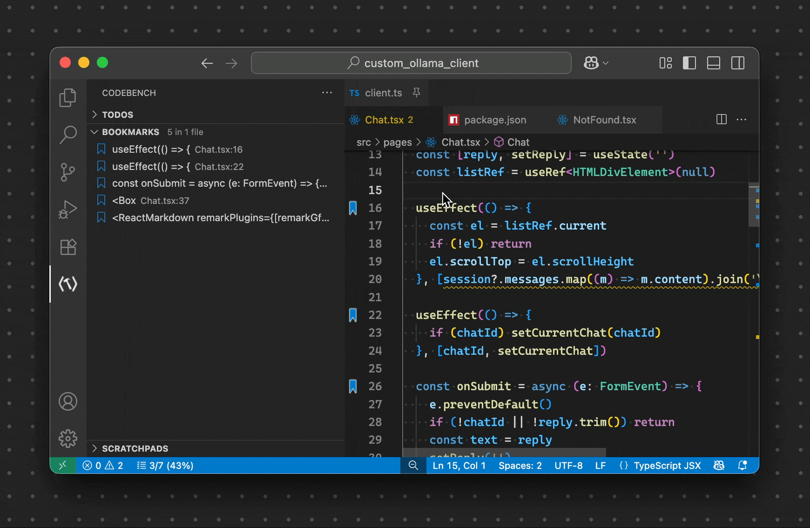
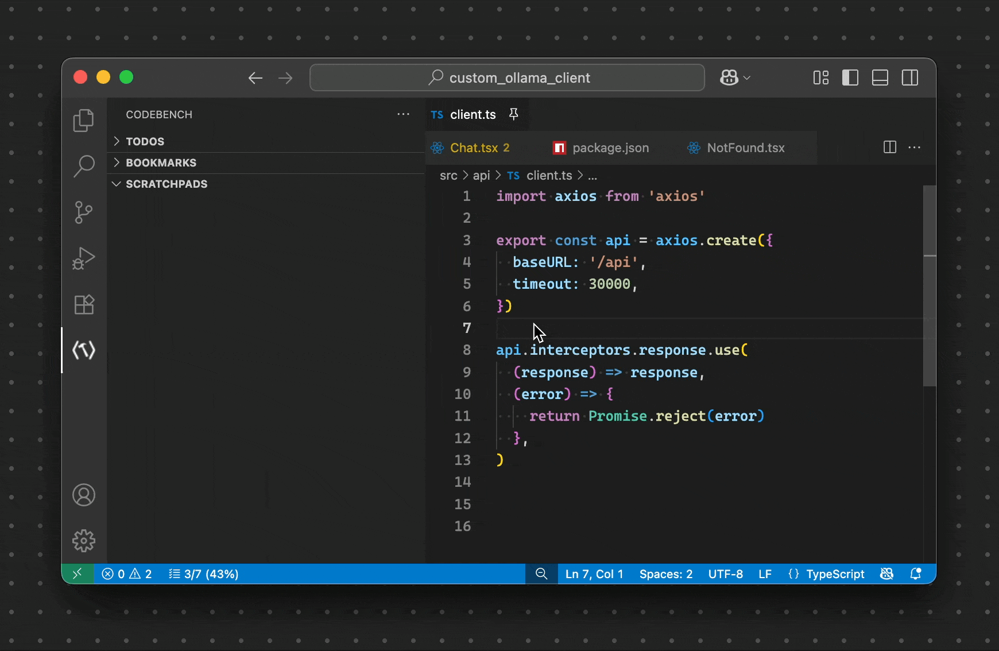

# VS CodeBench

<!-- 
 -->

A focused productivity extension that brings together hierarchical todos, bookmarks, and persistent scratchpads — all in one dedicated CodeBench view.

## Overview

## Why CodeBench?
Keep your flow inside the editor. Capture tasks, mark important code lines, and jot quick notes without switching apps or adding unwanted files to your repository. All data is tied to your active folder/workspace in VS Code.

## Features at a Glance

### Todos
Hierarchical tasks with sub-todos, inline progress, drag and drop reordering, and completion stats.

Reorder:

Indicator in the status bar:

### Bookmarks
Line-level bookmarks, color accents, folders with nesting and drag-and-drop organization.

Organise your bookmarks by folder or colour:

### Scratchpads
Quick, persistent scratch files to capture ideas/snippets.

## Default Keyboard Shortcuts
- Add Todo: Ctrl+Alt+T (macOS: ⌘⌥T)
- Create Scratchpad: Ctrl+Alt+P (macOS: ⌘⌥P)
- Toggle Bookmark (in file editors): Ctrl+Alt+K (macOS: ⌘⌥K)
- Change Bookmark Color (in file editors): Ctrl+Alt+Shift+K (macOS: ⌘⌥⇧K)

You can change these in File > Preferences > Keyboard Shortcuts.

## Commands (Command Palette)
- CodeBench: Add Todo
- CodeBench: Show Todo Statistics
- CodeBench: Toggle Bookmark
- CodeBench: Change Bookmark Color
- CodeBench: Create Scratchpad

## Views
- Todos: hierarchical task list with completion counts and a statistics panel
- Bookmarks: file/line bookmarks with optional color and folder organization
- Scratchpads: lightweight files for notes and snippets

## Limitations and Constraints
- Todos
  - Max items: 100 total
  - Nesting: up to 2 levels deep (parent -> child -> grandchild). Deeper nesting is blocked
  - Text length: 1–50 characters per todo
- Bookmarks
  - Folder depth: up to 3 levels deep (moving/creating beyond this is blocked)
  - Count: up to 200 bookmarks (hard limit); attempts beyond this are blocked

## Requirements
- VS Code 1.101.0 or newer

## Release Notes
### 1.0.0 (Initial)
- Comprehensive bookmark management with intuitive UI;
- Customizable bookmark colors;
- Integrated scratchpad for quick note-taking;
- TODO tracking with progress visualization;
- Seamless drag-and-drop functionality for organizing items.

## Known Issues
- None reported yet. Please file issues if you encounter problems.

## Feedback and Support
- Issues: https://github.com/nazariitaran/vs-codebench/issues
- Source: https://github.com/nazariitaran/vs-codebench

## License
MIT
